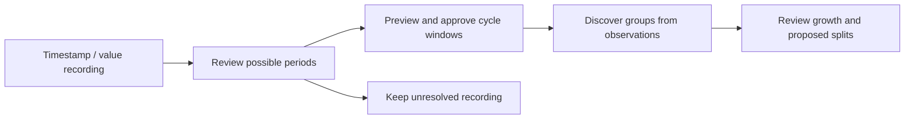

# Frequency-Agile Signal Atlas

A local-first explorer for unlabelled Frequency and PRI recordings. Discover repeating cycles, review extracted observations, and form stable groups from an empty measured workspace. A synthetic reference atlas remains available as an optional demo. Built with React, TypeScript and Vite; runs entirely in the browser with no backend or API keys. Interaction is inspired by [Three Body Orbits](https://www.threebodyorbits.com/).

[Open the app](https://iliketolie.github.io/signal-atlas/) · [Methodology](docs/methodology.md) · [Import formats](docs/imports.md) · [Roadmap](ROADMAP.md) · [Verification](VERIFICATION.md)

## Intended workflow and current scope

The v0.1.6 branch implements **unlabelled recordings → reviewed cycle discovery → groups formed from observations**. It opens with zero cycles and groups; synthetic catalogue data load only when you open the demo atlas. No class labels or known period are needed to start. **GitHub Pages publishes `release/v0.1.6`, tagged `v0.1.6`; main remains at v0.1.5.** Label-free stability diagnostics and measured-data validation remain planned. See the [recording walkthrough](docs/recordings.md), [workflow](docs/unlabelled-workflow.md) and [roadmap](ROADMAP.md).



## Run locally

Use Node.js 24+ and pnpm 11.25.0. If needed, install pnpm with `npm install -g pnpm@11.25.0`.

```sh
pnpm install --frozen-lockfile
pnpm dev
```

Other commands:

| Command | Purpose |
| --- | --- |
| `pnpm test` | Run the Node test suite |
| `pnpm build` | Type-check and build the static app |
| `pnpm preview` | Preview the production build |
| `pnpm generate` | Regenerate the checked-in catalogue and layouts (seed 20261006) |
| `pnpm evaluate` | Write local synthetic grouping evaluation reports |

## Using the atlas

- **Start from observations:** paste/upload a CSV or JSON recording without a period. Select a suggested period or enter one, preview consecutive windows, then **Approve & group**. **Paste an example recording** supplies a hopping Frequency or smooth PRI example with missing rows. Nothing is grouped until you approve extraction.
- **Browse:** switch between Frequency and PRI, pan/zoom the map, or use the grid. Named regions arrange groups into coloured islands; **Similarity projection** shows approximate metric relationships with collision-free tile spacing. Similar signals have separate selectable squares; neighbour ranking still uses the original metric.
- **Inspect and compare:** select a curve to see its units, period, excursion and provenance. Add two curves to comparison for original or normalized, phase-aligned views. Plots show three cycles with playback controls; Frequency inspector sweeps run faster while keeping a readable pace.
- **Known-cycle imports in the demo atlas:** upload or paste a repeating cycle as JSON or CSV, preview it, then save for automatic grouping. Sparse/discontinuous cycles support explicit linear or step/hold reconstruction with point/gap checks. See [formats](docs/imports.md) and [sparse cycles](docs/sparse-cycles.md).
- **Adjust grouping:** set the threshold, formula/vision blend and formula feature weights under **Grouping settings**, then **Apply & regroup**. Browsing weights are configured separately under Methodology.
- **Review growth:** **Try group review demo** shows a sinusoid with three related fringe curves: inspect, approve a split, undo it, or reset. Demo decisions are temporary and do not modify your workspace. Inspect your actual core/fringe membership and uncertain matches under **Group health & review**. Approve coherent fringe splits, keep or reassign matches, and undo decisions. See [group growth policy](docs/group-growth.md).
- **Synthetic evaluation:** open the optional demo atlas. **Run control demo** opens a temporary five-insert workspace. **Evaluate and calibrate grouping** fits, tunes and tests settings on separate source splits; it can also load human-labelled examples.

Recordings, cycle windows, supplied capture IDs, settings and the last 20 group decisions are saved locally, with separate Frequency/PRI grouping. The measured workspace supports 10 recordings and 100 extracted cycles; one source supports up to 50,000 rows / 2 MB. Export original recordings, individual cycles or the complete workspace before clearing browser data. Workspace restore is still planned. Existing synthetic-atlas imports/settings remain in their separate storage. There is no cloud sync.

## Sparse and discontinuous cycles, visually

A **gap** means a value was not observed. A **jump** means the signal changes abruptly. A repeating cycle can have either—or both.

[](docs/illustrations/sparse-cycles-guide.svg)

Green dots are observations; dashed curves are the chosen model between them. **Linear** connects observations with straight lines; **hold** keeps the previous value until the next observation. The original values and missing timestamps remain intact.

Sparse cycle extraction and known-cycle imports need an approved repeating period, **at least 8 observed points**, **no cyclic gap over 20% of the period**, and an explicit reconstruction choice. Preview the result before saving. These guards check coverage; they do not guarantee accuracy. See the [visual guide and import details](docs/sparse-cycles.md).

## How matching works

The measured workspace creates groups solely from approved observations. In the optional demo atlas, each quantity has 1,000 deterministic synthetic references arranged into 12 morphology regions. Reference regions use alternating k-medoids over normalized, circularly aligned RMS shape distances. Region names are browsing labels, not physical emitter classes. Local imports never change reference membership.

**Standard CV pixel overlap is the only vision method in the app.** Curves are normalized onto 128 phases, circularly aligned, rasterized into 128 × 32 soft grayscale images, and compared with soft pixel intersection-over-union. It requires no training or cloud service.

Automatic grouping defaults to **70% formula / 30% pixel overlap**, a **65% admission threshold**, and shape-only formula weights:

```text
formula similarity = exp(−weighted signal distance)
combined similarity = α × formula similarity + (1 − α) × pixel overlap
```

Each reference region supplies three fixed identity anchors; each new local group keeps its founder. Clear core support can add up to two coverage representatives, but every admission must still match a fixed anchor. In measured mode, support requires core members from three distinct supplied capture IDs; repeated windows from one capture count once, and unknown source independence stays provisional. Distinct shapes determine coverage representatives separately. The demo atlas retains its three-shape support proxy. Coherent fringe clusters produce split proposals for review. Imports are replayed in insertion order when settings change or an import is removed/restored. Frequency and PRI group separately, and active scale terms require compatible units.

The measured map starts in **Shape only**; **Shape + scale** and synthetic-atlas neighbour browsing use shape/period/excursion weights of **0.65 / 0.20 / 0.15**, with centre weight **0**. **Shape only** removes scale terms. Matching allows circular phase shifts, but no time warping, reversal or reflection. Map positions approximate distances; rankings use the full metric.

Scores are heuristic similarities, not probabilities. Synthetic evaluations do not establish measured-data accuracy. The [methodology reference](docs/methodology.md) covers normalization, units, map construction, grouping, calibration, benchmark results and limitations.

## Data and scope

The catalogue contains eight generator families plus diagnostic controls, with provenance and stable IDs. `tu` and `fu` are arbitrary units. Frequency excursion is max(f) − min(f), not occupied RF bandwidth. PRI curves are independently generated positive interval trajectories associated with the same reference IDs; they are not inferred from carrier frequency.

The separate [Signal Shapes v1 corpus](datasets/signal-shapes-v1/README.md) provides **2,304 uploadable CSVs**, source/component splits, integrity audits and a [verified ZIP](datasets/signal-shapes-v1.zip). The app imports one CSV at a time, not the ZIP or manifest.

Raw recordings require supported units, not a period. The first period search offers recurrence suggestions for review; constant, nonrepeating or poorly covered recordings can stay unresolved. Approving a cycle explicitly accepts its period and reconstruction. Nonperiodic-window grouping, IQ/spectrogram extraction and partial-cycle matching remain planned extensions. See [import formats](docs/imports.md) and the visual guide above.

## Unsuccessful improvement attempts

These experiments are retained as project history and are not selectable in the web app.

### WOA-medoids

The Whale Optimization Algorithm (WOA) medoid approach was an attempted improvement that was not adopted. This checkout contains no WOA implementation or benchmark report, so no quantitative result is claimed here. The catalogue continues to use deterministic alternating k-medoids.

### Siamese CNN

A shared CNN encoded normalized curve images into 16-value embeddings and compared them using mapped cosine similarity. It failed to improve frozen synthetic exact-source retrieval:

| Method | Held-out retrieval at rank 1 |
| --- | ---: |
| Formula only | 85.3% |
| Standard CV pixel overlap | 84.7% |
| Siamese CNN | 60.5% |

The CNN trailed pixel overlap by **24.2 percentage points**. These results measure exact-source retrieval from clean support galleries, not semantic grouping accuracy; the formula/CNN blend was not benchmarked. The [archived model card](models/README.md), [complete evaluation](models/siamese-evaluation.json), frozen weights and reproduction scripts remain available.

Saved CNN grouping settings activate defaults with a notice and remain untouched until new settings are explicitly applied. The app no longer loads or offers the CNN scorer.

## Development and deployment

| Area | Main files |
| --- | --- |
| Catalogue and comparisons | `src/catalogue.ts`, `src/priCatalogue.ts`, `src/signal.ts` |
| Regions and maps | `src/regions.ts`, `src/layout.ts`, `src/displayLayout.ts` |
| Grouping and pixel vision | `src/grouping.ts`, `src/groupPolicy.ts`, `src/vision.ts` |
| Evaluation and calibration | `src/evaluation.ts`, `src/evaluationData.ts`, `src/calibration.ts` |
| Imports and persistence | `src/importExport.ts`, `src/groupingStorage.ts`, `src/groupReviewStorage.ts` |
| UI and background work | `src/App.tsx`, `src/Atlas.tsx`, `src/Plot.tsx`, `src/*worker.ts` |

Tests cover matching invariants, unit compatibility, grouping/replay, imports, evaluation leakage, calibration, storage and archived CNN reproduction. See [VERIFICATION.md](VERIFICATION.md) for checks performed and remaining limits. Dense pairwise layouts and all-shifts alignment are intended for this catalogue size; larger datasets need a more scalable approach.

The [GitHub Pages workflow](.github/workflows/pages.yml) builds/tests pull requests. Deployment runs manually or when an explicit release update changes `public/version.json` on `release/v0.1.6`; ordinary code pushes do not deploy. See [deployment setup and project-path checks](docs/deployment.md). Release history is in [CHANGELOG.md](CHANGELOG.md).
