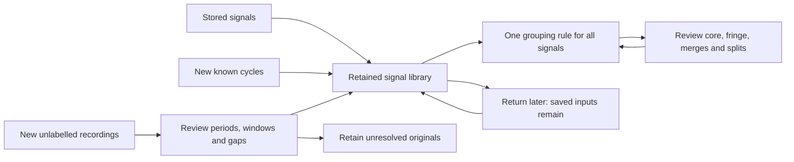
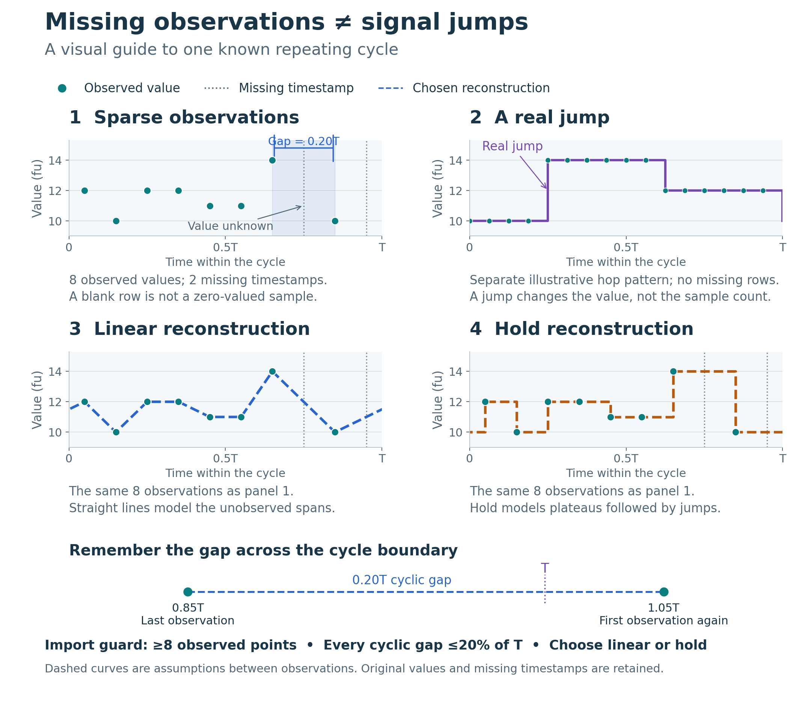

# Frequency-Agile Signal Atlas

A persistent, browser-local library of repeating Frequency and PRI signals. Keep stored signals, add imperfect or unlabelled inputs, and review how their groups evolve. The atlas includes 1,000 synthetic examples per quantity for demonstration; these are not established measured classes. Built with React, TypeScript and Vite, without a backend or API keys.

[Open the app](https://iliketolie.github.io/signal-atlas/) · [Methodology](docs/methodology.md) · [Import formats](docs/imports.md) · [Roadmap](ROADMAP.md) · [Verification](VERIFICATION.md)

## A retained library, with optional intake

The `feature/revised-inputs` preview keeps the atlas as the main screen. Opening it does not require a new recording. Saved complete-cycle imports, extracted cycles and original recordings remain in this browser across refreshes. **Recordings & new inputs** is an optional intake panel that adds to the library.



The app uses one map arranged by groups. Each signal has its own selectable square; tiles do not overlap or stack. Short names such as Crescent, Echo and Comet label the groups; saved reviewed names are preserved. Irregular islands form a constellation rather than a numbered row. Names and map spacing are illustrative and do not affect membership. Colour indicates membership. Use **Compare** and ranked neighbours for numerical resemblance.

The branch is tentatively marked **v0.1.6-preview.1**, pending validation as a final release; main remains at v0.1.5. [Workflow and remaining work](docs/unlabelled-workflow.md).

## Run locally

Use Node.js 24+ and pnpm 11.25.0.

```sh
pnpm install --frozen-lockfile
pnpm dev
```

| Command | Purpose |
| --- | --- |
| `pnpm test` | Run the Node test suite |
| `pnpm build` | Type-check and build the static app |
| `pnpm preview` | Preview the production build |
| `pnpm generate` | Regenerate the historical synthetic catalogue and benchmark layouts |
| `pnpm evaluate` | Write historical fixed-catalogue evaluation reports |

## Using the library

- **Browse existing signals:** switch Frequency/PRI with a brief waveform transition, search/filter groups, pan/zoom, or use Grid. The current map stays visible while the other quantity loads; unchanged completed views are reused. Transitions respect reduced-motion preferences. Synthetic examples are included initially and clearly marked. **Hide synthetic examples** shows saved measured cycles alone without deleting either source.
- **Add known cycles:** **Import cycle** accepts complete-cycle CSV/JSON, including sparse or discontinuous data. Preview before saving.
- **Add unknown-period data when needed:** open **Recordings & new inputs**, save the original recording, inspect proposed periods and approve usable windows. Labels are optional. Ambiguous or nonrepeating sources stay saved and unresolved. [Recording walkthrough](docs/recordings.md).
- **Inspect and compare:** select a signal for its units, provenance, original/reconstructed curve and match explanation. Compare two signals in original units or normalized, phase-aligned form. Frequency sweeps retain the faster v0.1.5 playback.
- **Review growth:** **Group health & review** shows core/fringe members, uncertain matches, split and merge proposals. Decisions require explicit action and support undo. **Try group review demo** provides an isolated split example. [Group policy](docs/group-growth.md).
- **Regroup deliberately:** **Grouping settings → Apply & regroup library** reclusters every visible signal under the chosen threshold and feature weights. It reassesses synthetic examples too. Comparison weights affect neighbours and pair comparison separately.
- **Evaluate carefully:** Methodology contains the historical labelled fixed-catalogue benchmark. It does not validate evolving library groups, and its fitted calibration is not applied to them.

Storage is local to this origin, browser and device; there is no shared server repository or cloud sync yet. Current limits remain **100 known-cycle imports, 10 recordings and 100 extracted cycles**, subject to browser quota. A recording accepts up to 50,000 rows / 2 MB. Export originals and cycles before clearing browser data. Recording export includes its legacy decisions; the new unified library review history is stored separately. Complete library backup/restore remains planned.

## Sparse and discontinuous cycles, visually

A **gap** is an unobserved value. A **jump** is an abrupt change. A repeating cycle can contain both.

[](docs/illustrations/sparse-cycles-guide.svg)

Green dots are observations; dashed curves are the selected model. **Linear** connects points; **hold** keeps the previous value until the next observation. Original values and missing timestamps remain intact.

Sparse cycles need an approved period, **at least 8 observed points**, **no cyclic gap above 20% of the period**, and an explicit reconstruction choice. These guards check coverage and do not guarantee accuracy. [Visual guide and import details](docs/sparse-cycles.md).

## How groups evolve

The historical 12-way partition remains only as a benchmark. The live library uses **complete-linkage hierarchical clustering**: start with individual shapes, merge the closest groups, and stop when further merging would put any member pair below the similarity threshold. **There is no preset minimum or maximum number of groups.** With the unchanged default 65% threshold and 70% formula / 30% vision blend, the bundled examples produce 30 Frequency groups and 29 PRI groups. These are measured outputs of the heuristic, not target counts or physical classes.

Each group selects a central real member (a medoid) after clustering. Distinct metric-equivalent shapes count once, so repeated copies cannot bias representative selection. Prefer clear, well-observed members; up to two additional core examples describe coverage. Representatives do not control admission: every member must fit every other member. Capture support still needs three distinct supplied **measured** capture IDs, separately from shape diversity.

New arrivals, removals and settings changes reassess the visible library. Automatic memberships, representatives and names can change; arrival order does not affect the same collection/settings. Explicit reviewed groups retain saved identities and names, with placements paused visibly when they fail whole-group cohesion. Review, reassignment, splits and compatible merges preserve original signals and persisted undo history.

Two similar signals can still belong to separate groups if they do not fit each other's other members. For example, Triangular 080 and 109 match each other at 69.82% but remain separated in the full default catalogue under the every-pair rule. Their separation no longer depends on a fixed founder veto. The stricter cohesion rule can fragment broad families; the threshold and scoring blend still need measured-data validation.

## Data and scope

The demo contains eight generator families and diagnostic controls, with stable IDs and provenance. `tu` and `fu` are arbitrary units. Excursion is max(f) − min(f), not occupied RF bandwidth. PRI trajectories are independently generated interval examples, not inferred from carrier frequency.

The separate [Signal Shapes v1 corpus](datasets/signal-shapes-v1/README.md) provides 2,304 CSVs and a [verified ZIP](datasets/signal-shapes-v1.zip). The app currently imports individual files. IQ/spectrogram extraction, pulse-timestamp PRI derivation and nonperiodic-window grouping remain separate extensions.

## Unsuccessful improvement attempts

These experiments are retained as project history and are not selectable in the web app.

### WOA-medoids

The Whale Optimization Algorithm (WOA) medoid approach was an attempted improvement that was not adopted. This checkout contains no WOA implementation or benchmark report, so no quantitative result is claimed here. The historical benchmark catalogue retains deterministic alternating k-medoids; live library grouping uses threshold-based discovery.

### Siamese CNN

A shared CNN encoded normalized curve images into 16-value embeddings and compared them using mapped cosine similarity. It failed to improve frozen synthetic exact-source retrieval:

| Method | Held-out retrieval at rank 1 |
| --- | ---: |
| Formula only | 85.3% |
| Standard CV pixel overlap | 84.7% |
| Siamese CNN | 60.5% |

The CNN trailed pixel overlap by **24.2 percentage points**. These results measure exact-source retrieval from clean support galleries, not semantic grouping accuracy; the formula/CNN blend was not benchmarked. The [archived model card](models/README.md), [complete evaluation](models/siamese-evaluation.json), frozen weights and reproduction scripts remain available.

Saved CNN grouping settings activate defaults with a notice and remain untouched until new settings are explicitly applied. The app no longer loads or offers the CNN scorer.

## Development and deployment

| Area | Main files |
| --- | --- |
| Catalogue and comparisons | `src/catalogue.ts`, `src/priCatalogue.ts`, `src/signal.ts` |
| Regions and maps | `src/regions.ts`, `src/layout.ts`, `src/displayLayout.ts` |
| Grouping and pixel vision | `src/grouping.ts`, `src/groupPolicy.ts`, `src/vision.ts` |
| Evaluation and calibration | `src/evaluation.ts`, `src/evaluationData.ts`, `src/calibration.ts` |
| Imports and persistence | `src/importExport.ts`, `src/groupingStorage.ts`, `src/groupReviewStorage.ts` |
| UI and background work | `src/App.tsx`, `src/Atlas.tsx`, `src/Plot.tsx`, `src/*worker.ts` |

Tests cover matching invariants, unit compatibility, grouping/replay, imports, evaluation leakage, calibration, storage and archived CNN reproduction. See [VERIFICATION.md](VERIFICATION.md) for checks performed and remaining limits. Dense pairwise layouts and all-shifts alignment are intended for this catalogue size; larger datasets need a more scalable approach.

The [GitHub Pages workflow](.github/workflows/pages.yml) builds/tests pull requests. Deployment runs manually or when an explicit preview update changes `public/version.json` on `feature/revised-inputs`; changes to the Pages workflow also deploy; ordinary code pushes do not deploy. See [deployment setup and project-path checks](docs/deployment.md). Release history is in [CHANGELOG.md](CHANGELOG.md).
