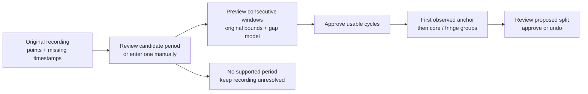
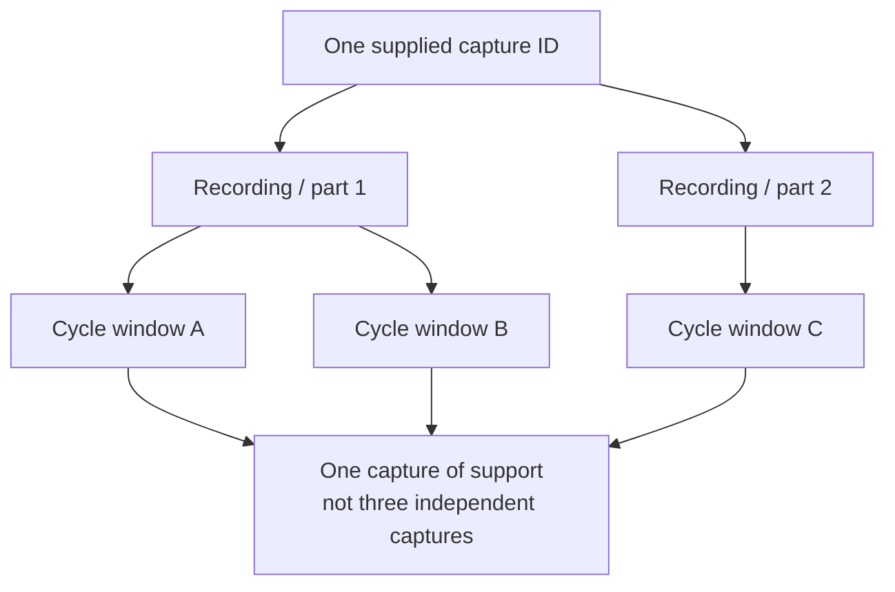

# From an unlabelled recording to observed groups

Implemented in the v0.1.6 branch release. Its Pages workflow targets `release/v0.1.6`. The measured workspace opens empty and needs no labels, supplied period or synthetic reference catalogue.



## Try the workflow

1. Choose **Frequency** or **Pulse interval (PRI)**. Select **Paste an example recording**, then **Save recording & discover cycles**. The examples contain six repetitions and missing rows, with no period or labels.
2. Choose a suggested period, or enter `1 ms` for the example. Use **hold** for its hopping Frequency values, **linear** for its smooth PRI values. Set the first window start and number of consecutive windows.
3. Select **Preview cycle windows**. Inspect the source timeline, selected span, reconstructed cycle and each window’s point/gap coverage. Preview does not save cycles or change groups.
4. Select **Approve & group**. The first observation seeds a provisional group; further observations join eligible groups or create new ones. Inspect the original source window and match reasons in the signal inspector.
5. Open **Group health & review**. Its **Try group review demo** separately demonstrates split approval and undo; its generated curves never enter your measured workspace.

Full downloadable examples: [hopping Frequency CSV](../public/examples/unlabelled-frequency-recording.csv) · [smooth PRI CSV](../public/examples/unlabelled-pri-recording.csv). These are generated controls, not measured validation data.

## Recording formats

CSV uses `t,f` or `t,pri`, with metadata comments or explicit CSV fields in the interface. This is an excerpt of the Frequency example:

```csv
# time_unit: ms
# frequency_unit: GHz
t,f
0,5.2
0.01,5.2
0.02,5.2
```

Use `# quantity: pri` and `# pri_unit: us` for PRI. A blank value or `null` is missing. `# capture_id: acquisition-001` and `# period: 1` are optional. CSV unit fields override file units; JSON supplies its own metadata. Frequency units are `Hz`, `kHz`, `MHz`, `GHz`, `fu`; time/PRI units are `s`, `ms`, `us`, `tu`.

JSON is one object with `samples: [{t, f}, …]`, `units: {time, frequency}`, optional `quantity: "pri"`, `name`, `captureId` and positive `period` / `periodHint`. Use `f: null` for missing values, or list `missingTimes` separately. Exported originals use finite `samples` plus `missingTimes`; they can be reimported as recordings. Do not specify the same missing timestamp twice or as an observed timestamp.

Timestamps must be finite and strictly increasing, but can start at any offset. Observed values must be finite; PRI must be positive. At least eight observed points are required to save a recording. There is no endpoint equality or nonzero-excursion requirement for a raw recording: constant and nonrepeating inputs can be retained unresolved. Limits are **2 MB / 50,000 rows per source**, **10 sources** and **100 approved cycles per workspace**.

## What a period suggestion means

The initial detector searches time lags in a worker. It compares up to 384 observed query points with short brackets around their shifted times. Brackets wider than three median observed spacings, or containing explicit missing timestamps, cannot supply recurrence evidence. Linear interpolation or hold is your explicit model between bracket observations; these values are modelled, not additional measurements.

Suggestions need:

- Roughly three repetitions in the recording and at least eight median sample spacings per period.
- At least 12 supported comparison pairs, at least 50% pair coverage, and recurrence resemblance ≥85% (`exp(−3 × normalized RMS error)`).
- At least two candidate windows with eight observations and no cyclic observation gap over 20% of the proposed period.

The search refines peaks from a finite lag grid and displays up to five candidates, including qualifying multiples. It is a heuristic rather than a confidence estimate, global optimization or guarantee of the fundamental period. The tests recover the supplied smooth and hopping controls to within 0.01 period units; this tolerance does not establish real-capture accuracy. Long recordings, variable repetition rates, drift, noise, sampling aliasing and small-scale features need further validation.

You must choose a period and approve extraction. A high carrier frequency (for example 5–8 GHz) is distinct from the period of its repeating frequency trajectory. Constant, short, nonperiodic or poorly covered recordings may yield no suggestion. They remain saved and unresolved; supplying a manual period still requires valid cycle coverage.

## Extraction and source support

Windows are consecutive `[start, start + period)` intervals wholly inside the observed timeline, with **1–25 windows per approval**. Values are copied without smoothing, timestamps are rebased, and explicit missing timestamps are retained. Each cycle needs **8–8193 observations**, nonzero excursion, and **no cyclic gap over 20% of its period**, including the last-to-first wrap. There is no arbitrary extrapolation beyond the recording. The approved periodic gap model supplies the wrap; it does not prove that unseen values repeat.

Each extracted cycle retains the source recording ID, original window bounds, file, supplied capture ID, period and reconstruction model. Repeating the same extraction is rejected; a different gap model cannot save the same source window twice. Different or overlapping windows from a source remain related observations.



Measured groups become capture-supported after clear core members span **three distinct supplied capture IDs**. Unknown IDs establish no independent support; filenames and generated recording IDs are not substituted. The IDs are your assertions, not independently verified acquisitions. Shape diversity separately controls additional representatives, so consistent sinusoidal captures can support one shape.

Approved extracted windows with maximum cyclic gap ≤5% can enter the core when their match is clear. Wider reconstructed gaps retain observation review and cannot automatically expand representative coverage. These are conservative initial review rules, not certified quality or calibrated probabilities.

## Map and persistence

The similarity projection is computed from approved observations, separately from group colours. Identical shapes retain identical metric coordinates internally, while display tiles are spread into unoccupied cells so each square remains selectable. Spacing adds visual displacement; distances and neighbour rankings are unchanged. Incompatible physical/arbitrary scale sets are projected separately, and their separation is illustrative.

Originals, cycles, per-quantity settings and the last 20 review decisions are saved together under `frequency-agile-atlas.measured.v1`. Synthetic-atlas imports, settings and review storage remain separate. Removing a source removes its cycles and resets review decisions for that quantity; **Undo removal** restores the prior workspace before another mutation. Group-decision undo affects review decisions without removing observations.

Export original recordings, individual cycle JSON or the whole versioned workspace. Complete workspace restore remains planned. Invalid saved data are left untouched with mutations blocked; the recovery export downloads the stored text. A failed storage write leaves the workspace unchanged. Data are local to this browser, with no cloud sync.

[README](../README.md) · [Sparse reconstruction](sparse-cycles.md) · [Group growth](group-growth.md) · [Remaining roadmap](../ROADMAP.md)
