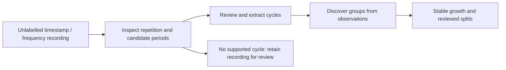

# Intended workflow: recordings to discovered groups

The v0.1.6 branch implements recording intake, reviewed period suggestions/extraction and grouping from an empty measured workspace. GitHub Pages serves this branch release; main remains at v0.1.5. The later diagnostics and identity-editing requirements below remain planned. The primary input is an unlabelled recording: timestamps and measured frequency values, with explicit units. No known class, group label or supplied cycle period should be required to begin.

A cycle is a repeating trajectory in one recording. A group collects similar cycles across recordings. The app must discover both at their respective stages; discovering a group does not establish a repeating period or a physical emitter identity.

## Current implementation and remaining work

| Step | Current development behavior | Remaining work |
| --- | --- | --- |
| Import raw recordings | Unknown-period CSV/JSON, explicit units, original timeline, retained unresolved data | Batch/corpus ingestion |
| Find repetition | Linear/hold recurrence candidates with evidence and competing multiples | Measured validation, method comparison and uncertainty assessment |
| Extract cycles | Reviewed period/start/count, preserved source windows, sparse coverage guards | More flexible per-window editing |
| Discover groups | Empty measured workspace; approved observations seed all groups | Rename/merge and deliberate anchor replacement |
| Keep group identity stable | Fixed observed anchors, bounded coverage, reviewed splits/undo; support counts supplied captures separately | Validated source/quality assessment |
| Evaluate without labels | Not implemented | Actual-workspace perturbation and stability diagnostics |

The [recording walkthrough](recordings.md) describes the operational controls and heuristic limits. The synthetic atlas is optional, fetched only when opened, and retains the existing known-cycle importer and supervised evaluation. Its catalogue does not seed measured groups.

## 1. Prepare recordings and discover cycles

Accept timestamp/frequency CSV or JSON with explicit units and an optional period hint. Validate observation order, missing values and recording boundaries separately from complete-cycle validation. Keep the original observations intact. GHz carrier frequency and the period of the repeating frequency trajectory are different quantities; period discovery concerns repetition over time.

Show the recording before proposing any cycle. Candidate periods should include evidence of repeated shape across observed windows, coverage and competing period/harmonic choices. Compare candidate-generation methods on dense, irregular, sparse and hopping controls before choosing an algorithm. Any temporary reconstruction used during detection must be explicit and must not turn gaps into measured evidence.

Allow the user to inspect repeated windows and approve or adjust the period and boundaries. The initial manual-window path and automatic recurrence suggestions are implemented; validation and more flexible window editing remain. A candidate period must be checked against multiple observed repetitions; one plausible-looking window alone is not evidence of repetition. Exact repetition counts and coverage thresholds need validation, not assumptions inherited from the synthetic catalogue.

If the recording is constant, insufficiently covered, nonperiodic or ambiguous, retain it as unresolved. Do not manufacture a loop by closing its endpoints. Preserve real jumps and distinguish the recording boundary from a confirmed cycle boundary. Nonperiodic-window grouping is a separate later mode.

Store each approved cycle's recording ID, acquisition/source ID when supplied, original window bounds, selected period, extraction method and reconstruction choice. Several cycles extracted from one capture are related observations, not independent captures. Phase alignment must preserve traversal direction and relative timing.

**Acceptance:** a timestamp/frequency recording with no period and no label can enter the workflow. A known-period control is recoverable within a documented tolerance; ambiguous and nonperiodic controls remain unresolved. Approving extraction produces inspectable cycles without changing the source recording.

## 2. Discover groups without catalogue seeds

Open a measured workspace with zero predefined groups. The first usable approved cycle can seed a provisional observed group; subsequent cycles join a qualifying group, enter review, or seed another group. Names such as Group 01 identify discovered groups without claiming a physical class. Unit and quantity compatibility remain explicit.

Retain fixed observed anchors, core/fringe membership, bounded additional representatives and approved splits. Fringe members must not expand an anchor's admission boundary. Show why a cycle joined or failed a group, and allow corrections with undo. Uncertain extraction or reconstruction should remain visible through grouping.

Separate two concepts currently conflated by the three-shape support heuristic:

- **Evidence for support:** clear observations from identifiable sources/acquisitions. Exact file copies or repeated processing of the same window must not count again. Several windows from one recording do not establish independent acquisition support.
- **Coverage of variation:** distinct shapes useful as additional representatives. A stable sinusoid group should not need three different waveform shapes to gain support. Independent captures can support the same shape without adding representatives.

Until source independence is known, report the observation count and lineage limits honestly. Do not infer independence from different filenames or IDs. A first observed anchor can itself be poor, so mark unsupported groups provisional and permit deliberate anchor replacement only as a versioned review decision, followed by reassessment of the members.

Existing synthetic calibration profiles are tied to their reference catalogue. They cannot silently transfer into a reference-free workspace. Initial admission thresholds are explicit heuristics until representative measured evidence supports alternatives. A small labelled subset can later validate the policy, but labels must remain optional for ordinary operation.

**Acceptance:** a completely empty workspace discovers groups from approved cycles without loading synthetic references or region labels. Compatible phase copies can share a group; unrelated shapes can form separate groups; gradual fringe chaining cannot move the identity anchor. Removing/restoring source data and undoing a split reproduce the documented outcome.

## 3. Evaluate unlabelled group behavior

A primary **Grouping stability** view should operate on the observed workspace. Compare equivalent runs under shuffled insertion orders, modest perturbations, missing-point controls and leave-one-capture-out checks. Compare member co-assignment, not group IDs, because founder IDs and display names can change between runs.

Report unstable members, group-count changes, fragmentation, within-group resemblance, competing groups, extraction/reconstruction coverage, anchor drift and source support. Perturbations must be appropriate to the signal and cannot assume a genuine hop is noise. Resample related windows together by capture so repeated cycles cannot inflate evidence.

These are diagnostics, not accuracy scores. One giant group can be stable, and many singleton groups can look compact. Show those failure modes alongside stability rather than optimizing a single internal metric. Without labels, false merges and false splits cannot be reported as established truth.

Keep the current **Evaluate and calibrate grouping** capability as an advanced labelled benchmark. It becomes useful when the user supplies reviewed labels for a subset of representative captures. Its current frozen-reference protocol needs a separate adaptation to discovered groups; it does not validate empty-workspace discovery, extraction or proposed split quality today.

**Acceptance:** label-free diagnostics run without an expected-region field, disclose the perturbation protocol and source coverage, preserve the actual workspace, and avoid presenting consistency as correctness.

## Delivery and persistence

Implement raw-recording preview and reviewed cycle extraction first, together with an empty measured grouping workspace. Follow with validated period suggestions and label-free stability diagnostics. Version the new recording/cycle/source relationships in workspace backup and restore; retain existing imports and the optional synthetic demo. Run extraction, grouping and repeated diagnostics in cancellable workers before increasing import capacity.

The first raw-recording scope is timestamp/frequency trajectories, matching the intended input. PRI trajectories can follow using the same distinction between recording and cycle. Detected pulse timestamps require their own PRI derivation workflow; IQ, spectral extraction and emitter identification remain separate extensions.

[Roadmap](../ROADMAP.md) · [Current group policy](group-growth.md) · [Sparse-cycle support](sparse-cycles.md) · [README](../README.md)
