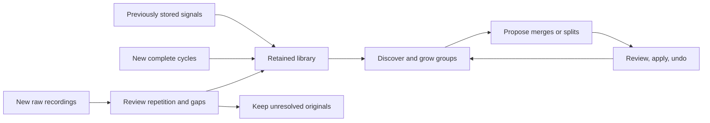

# A retained library that accepts unlabelled inputs

The primary workflow is a continuing signal directory: return to stored signals, add new observations when needed, and review group evolution. A new raw recording is not required each time the app opens. The `feature/revised-inputs` branch retains the atlas-style interface and optional recording intake; main remains at v0.1.5.

A recording contains timestamp/value observations. A cycle is an approved repeating window from a recording. A group collects similar cycles across sources. None of these establishes a physical emitter identity.

## What the feature branch now does

- Opens the retained atlas, with clearly marked synthetic examples included initially. Existing known-cycle imports and extracted observations appear in the same collection.
- Provides **Recordings & new inputs** as an optional source-management panel. It retains raw observations, missing timestamps and unresolved sources. Unknown periods are suggestions for review, not prerequisites or automatic truths.
- Applies the same threshold-based group discovery to all visible cycles. There is no permanent 12-group live partition. Labels are optional and generator provenance does not select membership.
- Uses one map arranged by groups, with separate selectable tiles. Comparison and neighbour scores carry the numerical resemblance information.
- Keeps anchors stable between reviewed structural decisions, limits coverage growth to clear core members, and proposes conservative merges and coherent fringe splits with undo.
- Allows **Hide synthetic examples** to rebuild the view from stored measured signals without deleting data. Decisions with hidden anchors pause visibly.

The initial discovery is a deterministic, insertion-order-dependent anchored heuristic. New arrivals contribute coverage/support and can form new groups; they do not silently replace established founders. Deliberate setting changes replay the complete visible library. Reviewed medoid replacement and broader whole-library reassessment remain planned.

## Imperfect observations

Use a supplied cycle period when known; otherwise save a recording and review the recurrence suggestions and windows. Preserve real jumps using an explicit hold model where appropriate. Linear filling is another explicit assumption, not measured evidence. Sparse windows need eight observed points and no cyclic gap above 20% of the period.

Constant, nonrepeating, ambiguous or poorly covered originals stay saved and unresolved. The app does not manufacture a cycle by closing recording endpoints or extrapolating beyond source bounds. Approved windows retain original recording IDs, bounds, capture IDs when supplied, and reconstruction choices. [Operational walkthrough](recordings.md).

## Support, identity and scaling

Measured support requires core observations from three distinct supplied capture IDs. Multiple windows from one acquisition count once; synthetic copies and unknown IDs do not establish independent evidence. Shape diversity controls coverage representatives separately, so independent observations of the same sinusoid can support a group without inventing new shapes.

The current library is browser-local, with bounded import capacity and no shared backend. A directory growing from 1,000 to 10,000 signals needs durable indexed storage, batch processing, indexed/cached matching, bounded representative updates and virtualized browsing. An expandable 10,000-tile layout is tested, but complete capacity is not yet implemented.

Future whole-library reassessment should propose identity-preserving merges, splits and representative replacements with affected-member previews and structural history. Source-aware order/perturbation diagnostics and measured validation must assess both instability and excessive fragmentation/giant clusters. Optional reviewed labels can validate subsets; ordinary operation should not require labels.

[Roadmap](../ROADMAP.md) · [Group policy](group-growth.md) · [README](../README.md)
